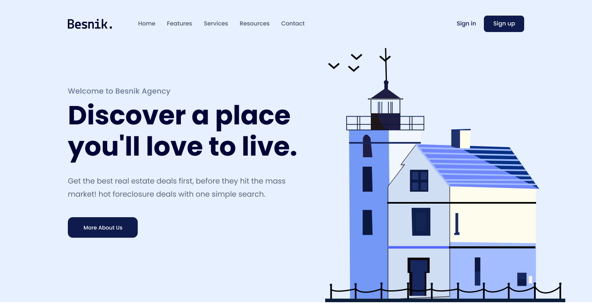
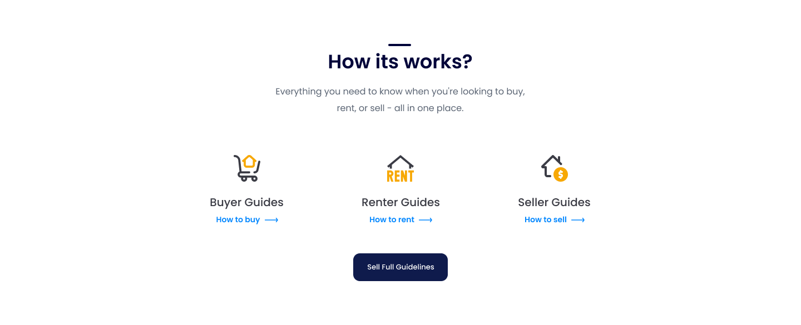
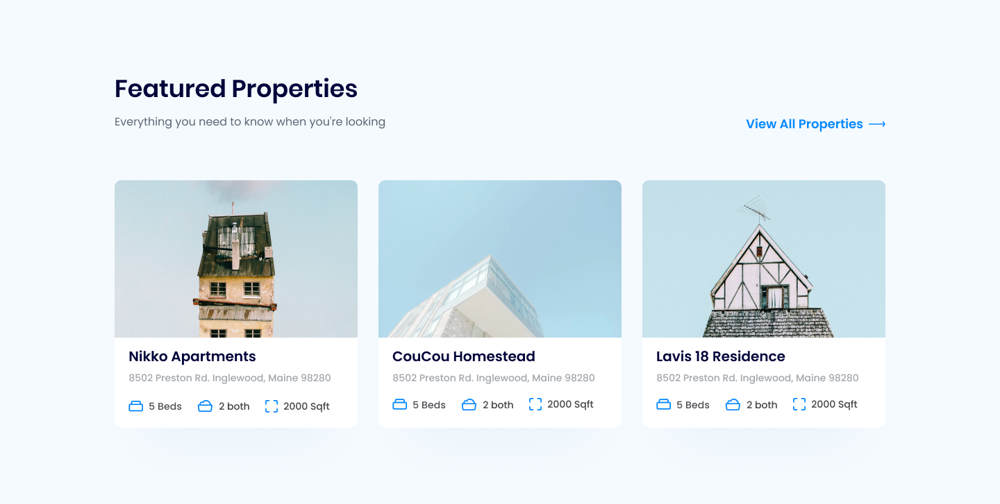
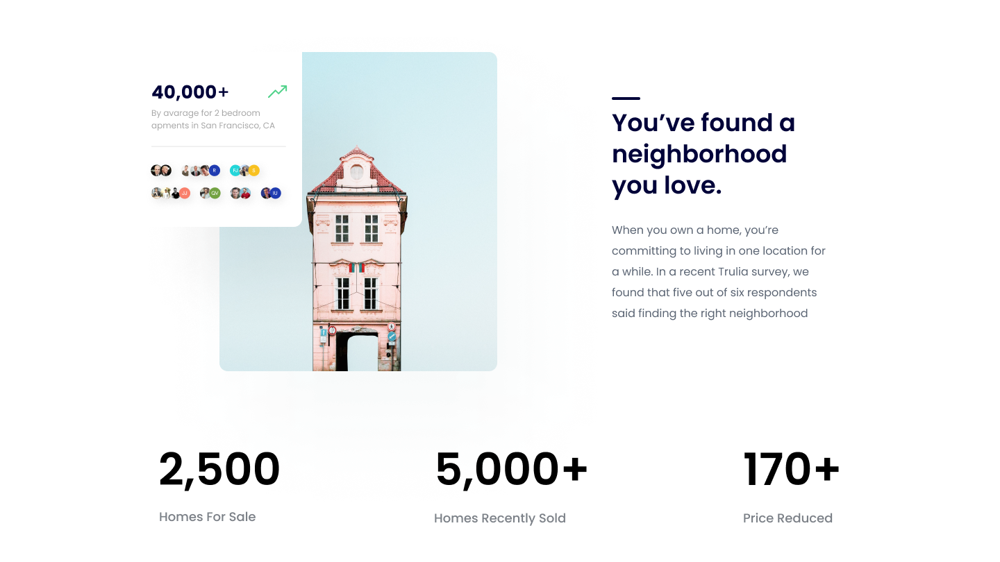
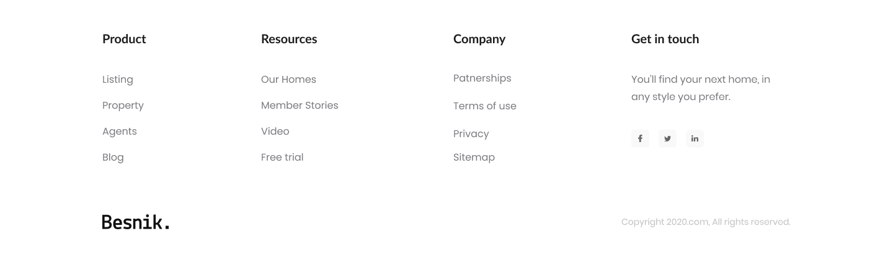

# Real-Estate-Landing-Page

## Header

## Client

    

## Guides

    

## Feature

## Stats

    

## Footer

    

### I made Real Estate Landing Page using HTML, CSS only

> I deployed my project on github page. so you can check it out 👇
>  

### [📌Resources](<https://www.figma.com/file/PzWSXPWcn4GCZWkvFPdalX/01.-Real-Estate-Landing-Page-(Easy)-(Copy)?type=design&node-id=2%3A410&mode=design&t=fM6aftY4e1DvWf4p-1>)

## What I Learned from this Project?

-   I learned how we use html, css to build web pages (no responsive)

## Author

-   [@blueWhale](https://github.com/blueWhale1202)
